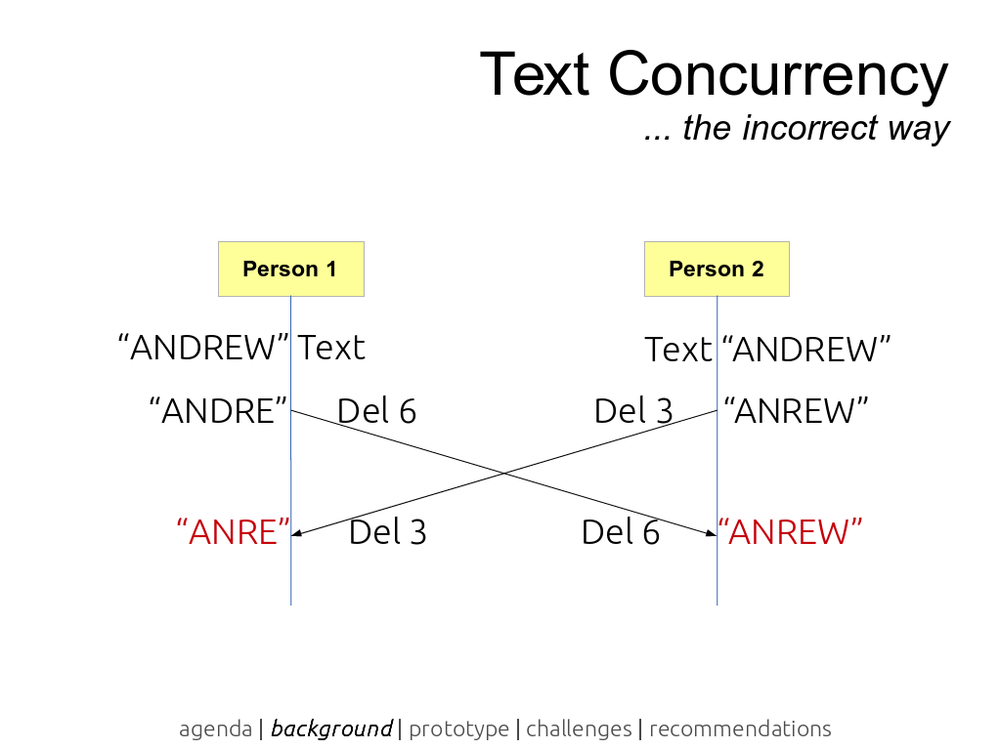
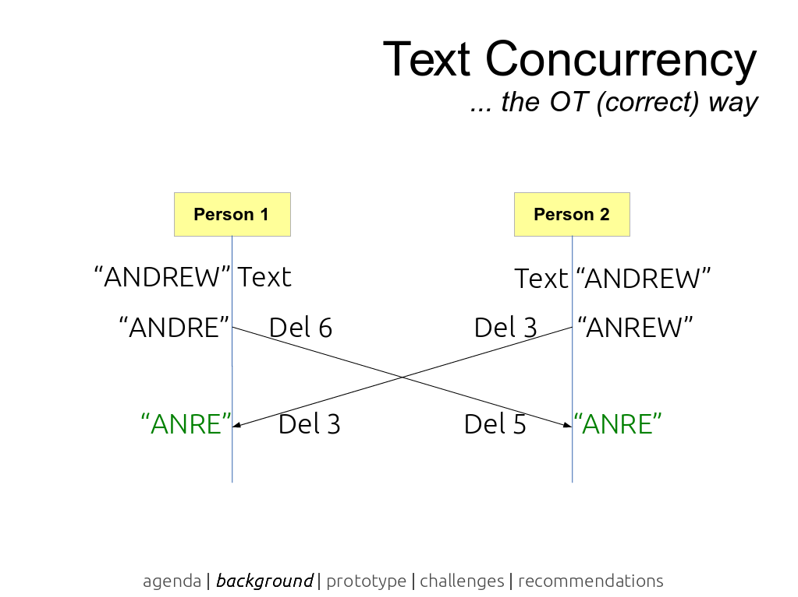
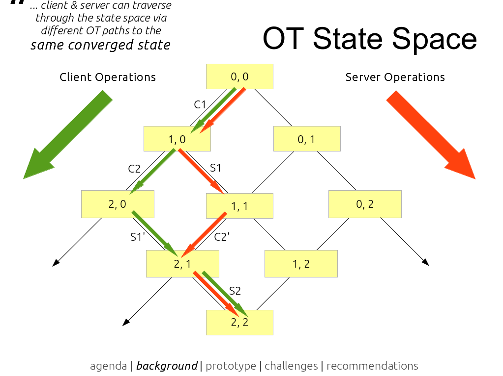
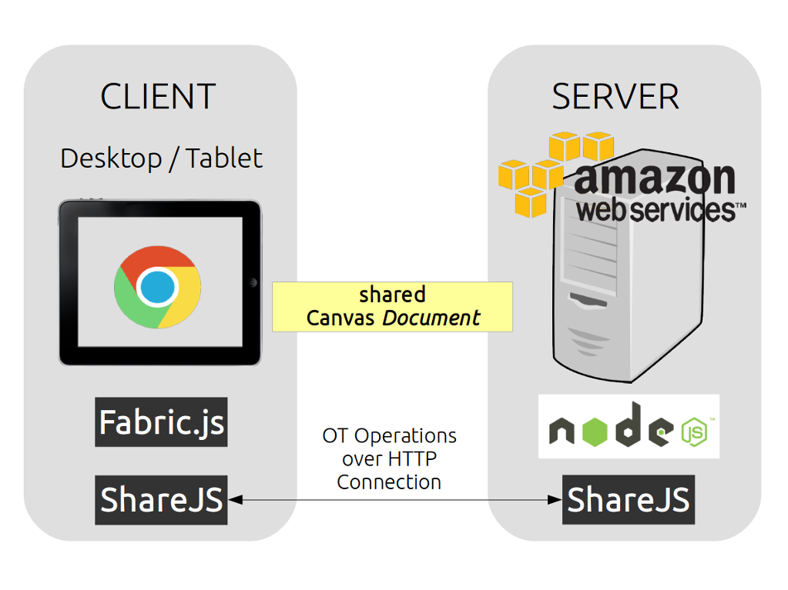

# PlaySketch: a collaborative sketcing tool

PlaySketch is an informal web-based sketching tool that targets video game designers. Featureing real-time collaboration, it allows teams of users to collaborate on the same sketch, or a single user to work across multiple devices.

This web-based app is the result of an individual research project I undertook in the Singapore Management University, and supervised by Dr. Richard C. Davis. This page summarises my findings and functionalities of the PlaySketch prototype implemented to demonstrate the application of Operational Transformation as the underlying real-time technology in collaborative sketching on HTML5 Canvas.

## Operational Transformation

Pioneered by Ellis and Gibbs in 1989, Operational Transformation (OT) is currently the most extensively used concurrency control technology used in modern web-based collaborative tools (e.g. Google Docs, Trello). Early implementations of OT algorithms focused on solving concurrency and consistency issues in text editing groupware systems, with an example of one such issue diagrammed below:

The concurrency issue here occurs when the *operation* “Del 6” is propagated from Person 1 to Person 2's text editor. Because Person 2 has already removed the third character from the string in *operation* “Del 3”, “Del 6” cannot be achieved as there are now only five characters left. OT algorithms introduce the concept of *transforming* any concurrent incoming *operation* from other sites against the *operation* that has been executed locally.

OT can be implemented in client-server protocols that support collaboration between any number of clients. The state space diagram below shows all possible traversals of client and server operations. The document state is represented by a tuple of numbered client (left integer) and server (right integer) operations.

## Prototyping with Node.js, ShareJS and Fabric.js

My research highlighted the [ShareJS](https://github.com/share/ShareJS "ShareJS GitHub Page") OT library implemented in Node.js as a promising toolkit to test OT in HTML5 web apps due to the library's support [*operations* on arbitrary JSON documents](https://github.com/ottypes/json0 "JSON OT Type"). Combined with [Fabric.js](http://fabricjs.com "Fabric.js Home Page"), a HTML5 Canvas JavaScript library using JSON documents to represent sketches and shapes, following client-server architecture was used to develop the PlaySketch prototype:

